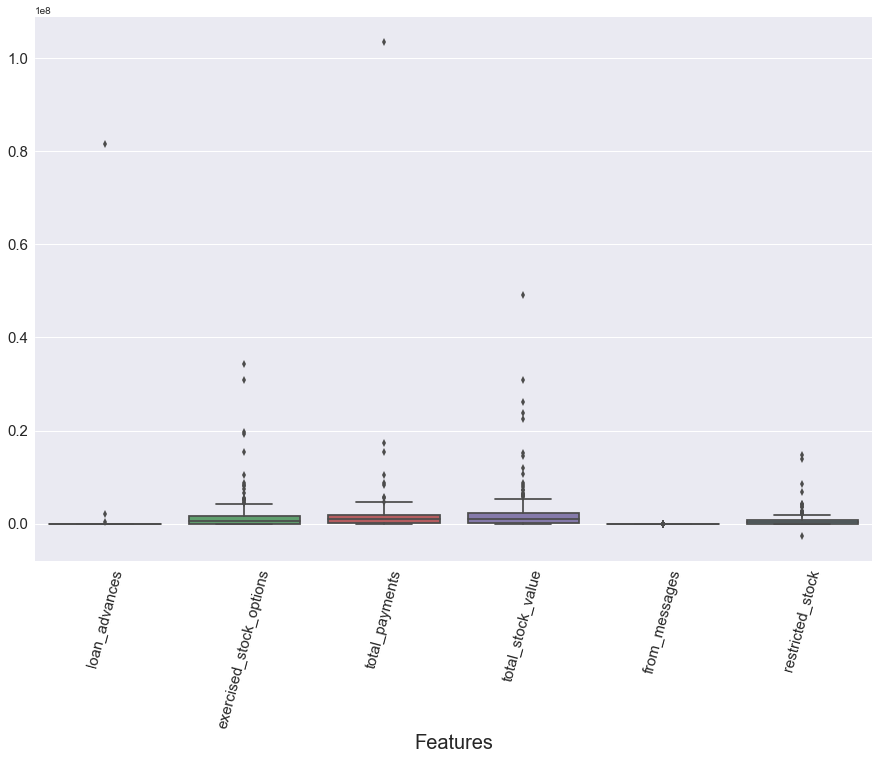
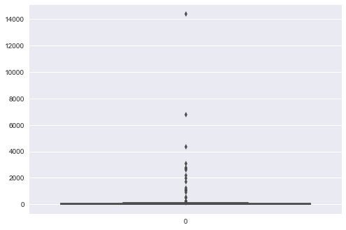
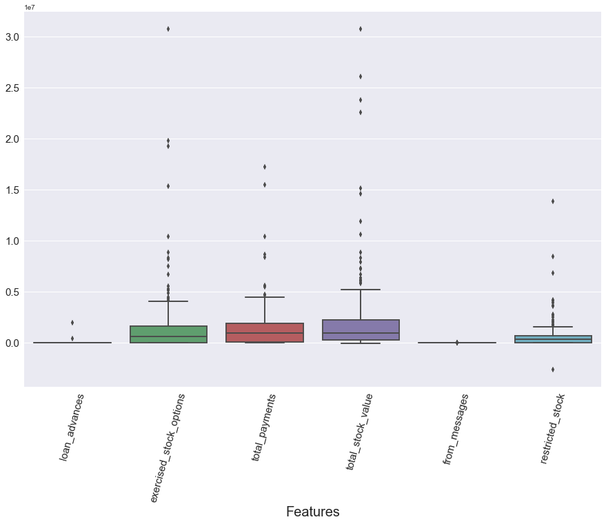

# <center> Projeto: Identificando fraude no Email da Enron.</center>  <center> Identificação de suspeitos utilizando Machine Learning</center>   
## <center> Udacity Data Analyst Nanodegree</center>    
<center> <span style="color:blue; font-size: 1.5em;">Vagner Sanches Vasconcelos</span></center>
<center> <span style="color:blue; font-size: 1.0em;">vsvasconcelos@gmail.com</span></center>
<center> <span style="color:red">27 de maio de 2017</span> </center>

# 1. Introdução
Este projeto utiliza um conjunto de dados que contém informações de e-mails enviados e/ou recebidos e dados financeiros de funcionários da empresa [Enron Corporation](https://pt.wikipedia.org/wiki/Enron), que em 2000 era uma das maiores empresas dos Estados Unidos e dois anos mais tarde faliu depois de um dos maiores escândalos de corrupção da história americana, conforme apresentado no vídeo [Enron os mais espertos da sala](https://www.youtube.com/watch?v=5jORoEE-CEk).     

[](https://www.youtube.com/watch?v=DgRLlqEvOT8)

## 1.1 Objetivo 
O objetivo deste trabalho é a construção de um modelo preditivo, utilizando aprendizagem de máquina, para determinar se um funcionário da Enron é ou não um POI (Persons Of Interest), isto é, um suspeito de participar da fraude.  
O modelo proposto deve possuir para cada uma das métricas [Precision e Recall](http://scikit-learn.org/stable/auto_examples/model_selection/plot_precision_recall.html) um valor mínimo de 0.3.

## 1.2 Ferramental
Todo o projeto foi desenvolvido na linguagem Python com auxílio da biblioteca [SciKit-learn](https://pt.wikipedia.org/wiki/Scikit-learn), utilizando algoritmos de classificação conforme fluxograma abaixo.             
Todo o código produzido, bem como demais arquivos, estão no [GitHub](https://github.com/vsvasconcelos/ML) do autor.   
[](http://scikit-learn.org/stable/tutorial/machine_learning_map/index.html)

## 1.3 Conjunto de dados
A fraude na Enron resultou em uma investigação federal, na qual muitos dados que são normalmente confidenciais, se tornaram públicos, incluindo dezenas de milhares de e-mails e detalhes financeiros dos executivos, em todos os níveis, da empresa. 
É esse conjunto de dados que é utilizado neste projeto; ele é intitulado: __Enron financial and email__, é público e pode ser acessado no site da [Carnegie Mellon University](https://www.cs.cmu.edu/~./enron/).    
>Carregando a base de dados ...


```python
#!/usr/bin/python

import sys
import pickle
import warnings
warnings.filterwarnings('ignore')
sys.path.append("../tools/")

from feature_format import featureFormat, targetFeatureSplit
from tester import dump_classifier_and_data, main
with open("final_project_dataset.pkl", "r") as data_file:
    data_dict = pickle.load(data_file)
```

Os dados são carregados em uma estrutura de dados tipo dict (dicionário), na qual cada par chave/valor corresponde a um funcionário. A chave do dicionário é o nome do funcionário, e o valor é outro dicionário, que contém o nome de todos os atributos e seus valores para aquele funcionário. Os atributos nos dados possuem basicamente três tipos: atributos financeiros, de email e rótulos POI.
> __Atributos financeiros:__ ['salary', 'deferral_payments', 'total_payments', 'loan_advances', 'bonus', 'restricted_stock_deferred', 'deferred_income', 'total_stock_value', 'expenses', 'exercised_stock_options', 'other', 'long_term_incentive', 'restricted_stock', 'director_fees'] (todos em dólares americanos (USD))   

> __Atributos de email:__ ['to_messages', 'email_address', 'from_poi_to_this_person', 'from_messages', 'from_this_person_to_poi', 'shared_receipt_with_poi'] (as unidades aqui são geralmente em número de emails; a exceção notável aqui é o atributo ‘email_address’, que é uma string) 

> __Rótulo POI:__ [‘poi’] (atributo objetivo lógico (booleano), representado como um inteiro)

# 2. Seleção dos atributos (*features*)
Para sustentar a seleção dos atributos que serão utilizados foi realizado inicialmente uma Análise Exploratória dos Dados (AED) da base.  
>Convertendo a base para um DataFrame [Pandas](https://en.wikipedia.org/wiki/Pandas_(software).


```python
import pandas as pd
import numpy as np
data_dict_df = pd.DataFrame(data_dict.values(), index=data_dict.keys())
```

>Verificando as dimensões da base de dados:


```python
data_dict_df.shape
```


    (146, 21)


A base possui 146 Observações (linhas) e 21 Variáveis (colunas).    
>Visão geral da base:


```python
data_dict_df.head(3)
```


<div>
<table border="1" class="dataframe">
  <thead>
    <tr style="text-align: right;">
      <th></th>
      <th>bonus</th>
      <th>deferral_payments</th>
      <th>deferred_income</th>
      <th>director_fees</th>
      <th>email_address</th>
      <th>exercised_stock_options</th>
      <th>expenses</th>
      <th>from_messages</th>
      <th>from_poi_to_this_person</th>
      <th>from_this_person_to_poi</th>
      <th>...</th>
      <th>long_term_incentive</th>
      <th>other</th>
      <th>poi</th>
      <th>restricted_stock</th>
      <th>restricted_stock_deferred</th>
      <th>salary</th>
      <th>shared_receipt_with_poi</th>
      <th>to_messages</th>
      <th>total_payments</th>
      <th>total_stock_value</th>
    </tr>
  </thead>
  <tbody>
    <tr>
      <th>METTS MARK</th>
      <td>600000</td>
      <td>NaN</td>
      <td>NaN</td>
      <td>NaN</td>
      <td>mark.metts@enron.com</td>
      <td>NaN</td>
      <td>94299</td>
      <td>29</td>
      <td>38</td>
      <td>1</td>
      <td>...</td>
      <td>NaN</td>
      <td>1740</td>
      <td>False</td>
      <td>585062</td>
      <td>NaN</td>
      <td>365788</td>
      <td>702</td>
      <td>807</td>
      <td>1061827</td>
      <td>585062</td>
    </tr>
    <tr>
      <th>BAXTER JOHN C</th>
      <td>1200000</td>
      <td>1295738</td>
      <td>-1386055</td>
      <td>NaN</td>
      <td>NaN</td>
      <td>6680544</td>
      <td>11200</td>
      <td>NaN</td>
      <td>NaN</td>
      <td>NaN</td>
      <td>...</td>
      <td>1586055</td>
      <td>2660303</td>
      <td>False</td>
      <td>3942714</td>
      <td>NaN</td>
      <td>267102</td>
      <td>NaN</td>
      <td>NaN</td>
      <td>5634343</td>
      <td>10623258</td>
    </tr>
    <tr>
      <th>ELLIOTT STEVEN</th>
      <td>350000</td>
      <td>NaN</td>
      <td>-400729</td>
      <td>NaN</td>
      <td>steven.elliott@enron.com</td>
      <td>4890344</td>
      <td>78552</td>
      <td>NaN</td>
      <td>NaN</td>
      <td>NaN</td>
      <td>...</td>
      <td>NaN</td>
      <td>12961</td>
      <td>False</td>
      <td>1788391</td>
      <td>NaN</td>
      <td>170941</td>
      <td>NaN</td>
      <td>NaN</td>
      <td>211725</td>
      <td>6678735</td>
    </tr>
  </tbody>
</table>
<p>3 rows × 21 columns</p>
</div>


É possível observar vários valores faltantes NaN (*Not a Number*); assim, isto deve ser levado em consideração para não influenciar os cálculos,  por exemplo, na estatística descritiva.    
>Convertendo os NaN para o padrão do pacote [Numpy](https://pt.wikipedia.org/wiki/NumPy).


```python
data_dict_df = data_dict_df.replace('NaN', np.NaN)
```

>Tipos de dados das variáveis:


```python
data_dict_df.dtypes
```


    bonus                        float64
    deferral_payments            float64
    deferred_income              float64
    director_fees                float64
    email_address                 object
    exercised_stock_options      float64
    expenses                     float64
    from_messages                float64
    from_poi_to_this_person      float64
    from_this_person_to_poi      float64
    loan_advances                float64
    long_term_incentive          float64
    other                        float64
    poi                             bool
    restricted_stock             float64
    restricted_stock_deferred    float64
    salary                       float64
    shared_receipt_with_poi      float64
    to_messages                  float64
    total_payments               float64
    total_stock_value            float64
    dtype: object


A grande maioria das variáveis são do tipo __numérica__ (float64); há ainda uma variável do tipo __categórica__ (bool) e uma do tipo __texto__ (object).      
>Estatística descritiva da base:


```python
data_dict_df.describe()
```


<div>
<table border="1" class="dataframe">
  <thead>
    <tr style="text-align: right;">
      <th></th>
      <th>bonus</th>
      <th>deferral_payments</th>
      <th>deferred_income</th>
      <th>director_fees</th>
      <th>exercised_stock_options</th>
      <th>expenses</th>
      <th>from_messages</th>
      <th>from_poi_to_this_person</th>
      <th>from_this_person_to_poi</th>
      <th>loan_advances</th>
      <th>long_term_incentive</th>
      <th>other</th>
      <th>restricted_stock</th>
      <th>restricted_stock_deferred</th>
      <th>salary</th>
      <th>shared_receipt_with_poi</th>
      <th>to_messages</th>
      <th>total_payments</th>
      <th>total_stock_value</th>
    </tr>
  </thead>
  <tbody>
    <tr>
      <th>count</th>
      <td>8.200000e+01</td>
      <td>3.900000e+01</td>
      <td>4.900000e+01</td>
      <td>1.700000e+01</td>
      <td>1.020000e+02</td>
      <td>9.500000e+01</td>
      <td>86.000000</td>
      <td>86.000000</td>
      <td>86.000000</td>
      <td>4.000000e+00</td>
      <td>6.600000e+01</td>
      <td>9.300000e+01</td>
      <td>1.100000e+02</td>
      <td>1.800000e+01</td>
      <td>9.500000e+01</td>
      <td>86.000000</td>
      <td>86.000000</td>
      <td>1.250000e+02</td>
      <td>1.260000e+02</td>
    </tr>
    <tr>
      <th>mean</th>
      <td>2.374235e+06</td>
      <td>1.642674e+06</td>
      <td>-1.140475e+06</td>
      <td>1.668049e+05</td>
      <td>5.987054e+06</td>
      <td>1.087289e+05</td>
      <td>608.790698</td>
      <td>64.895349</td>
      <td>41.232558</td>
      <td>4.196250e+07</td>
      <td>1.470361e+06</td>
      <td>9.190650e+05</td>
      <td>2.321741e+06</td>
      <td>1.664106e+05</td>
      <td>5.621943e+05</td>
      <td>1176.465116</td>
      <td>2073.860465</td>
      <td>5.081526e+06</td>
      <td>6.773957e+06</td>
    </tr>
    <tr>
      <th>std</th>
      <td>1.071333e+07</td>
      <td>5.161930e+06</td>
      <td>4.025406e+06</td>
      <td>3.198914e+05</td>
      <td>3.106201e+07</td>
      <td>5.335348e+05</td>
      <td>1841.033949</td>
      <td>86.979244</td>
      <td>100.073111</td>
      <td>4.708321e+07</td>
      <td>5.942759e+06</td>
      <td>4.589253e+06</td>
      <td>1.251828e+07</td>
      <td>4.201494e+06</td>
      <td>2.716369e+06</td>
      <td>1178.317641</td>
      <td>2582.700981</td>
      <td>2.906172e+07</td>
      <td>3.895777e+07</td>
    </tr>
    <tr>
      <th>min</th>
      <td>7.000000e+04</td>
      <td>-1.025000e+05</td>
      <td>-2.799289e+07</td>
      <td>3.285000e+03</td>
      <td>3.285000e+03</td>
      <td>1.480000e+02</td>
      <td>12.000000</td>
      <td>0.000000</td>
      <td>0.000000</td>
      <td>4.000000e+05</td>
      <td>6.922300e+04</td>
      <td>2.000000e+00</td>
      <td>-2.604490e+06</td>
      <td>-7.576788e+06</td>
      <td>4.770000e+02</td>
      <td>2.000000</td>
      <td>57.000000</td>
      <td>1.480000e+02</td>
      <td>-4.409300e+04</td>
    </tr>
    <tr>
      <th>25%</th>
      <td>4.312500e+05</td>
      <td>8.157300e+04</td>
      <td>-6.948620e+05</td>
      <td>9.878400e+04</td>
      <td>5.278862e+05</td>
      <td>2.261400e+04</td>
      <td>22.750000</td>
      <td>10.000000</td>
      <td>1.000000</td>
      <td>1.600000e+06</td>
      <td>2.812500e+05</td>
      <td>1.215000e+03</td>
      <td>2.540180e+05</td>
      <td>-3.896218e+05</td>
      <td>2.118160e+05</td>
      <td>249.750000</td>
      <td>541.250000</td>
      <td>3.944750e+05</td>
      <td>4.945102e+05</td>
    </tr>
    <tr>
      <th>50%</th>
      <td>7.693750e+05</td>
      <td>2.274490e+05</td>
      <td>-1.597920e+05</td>
      <td>1.085790e+05</td>
      <td>1.310814e+06</td>
      <td>4.695000e+04</td>
      <td>41.000000</td>
      <td>35.000000</td>
      <td>8.000000</td>
      <td>4.176250e+07</td>
      <td>4.420350e+05</td>
      <td>5.238200e+04</td>
      <td>4.517400e+05</td>
      <td>-1.469750e+05</td>
      <td>2.599960e+05</td>
      <td>740.500000</td>
      <td>1211.000000</td>
      <td>1.101393e+06</td>
      <td>1.102872e+06</td>
    </tr>
    <tr>
      <th>75%</th>
      <td>1.200000e+06</td>
      <td>1.002672e+06</td>
      <td>-3.834600e+04</td>
      <td>1.137840e+05</td>
      <td>2.547724e+06</td>
      <td>7.995250e+04</td>
      <td>145.500000</td>
      <td>72.250000</td>
      <td>24.750000</td>
      <td>8.212500e+07</td>
      <td>9.386720e+05</td>
      <td>3.620960e+05</td>
      <td>1.002370e+06</td>
      <td>-7.500975e+04</td>
      <td>3.121170e+05</td>
      <td>1888.250000</td>
      <td>2634.750000</td>
      <td>2.093263e+06</td>
      <td>2.949847e+06</td>
    </tr>
    <tr>
      <th>max</th>
      <td>9.734362e+07</td>
      <td>3.208340e+07</td>
      <td>-8.330000e+02</td>
      <td>1.398517e+06</td>
      <td>3.117640e+08</td>
      <td>5.235198e+06</td>
      <td>14368.000000</td>
      <td>528.000000</td>
      <td>609.000000</td>
      <td>8.392500e+07</td>
      <td>4.852193e+07</td>
      <td>4.266759e+07</td>
      <td>1.303223e+08</td>
      <td>1.545629e+07</td>
      <td>2.670423e+07</td>
      <td>5521.000000</td>
      <td>15149.000000</td>
      <td>3.098866e+08</td>
      <td>4.345095e+08</td>
    </tr>
  </tbody>
</table>
</div>


>Quantas funcionários há na base?


```python
len(data_dict_df)
```


    146


Existem 146 funcionários na base de dados sendo que cada um deles possui até 21 atributos registrados.    
Como existem muitos valores faltantes (NaN) nem todos possuem todos os atributos.   
>Quantos atributos existem para cada variável?


```python
data_dict_df.count()
```


    bonus                         82
    deferral_payments             39
    deferred_income               49
    director_fees                 17
    email_address                111
    exercised_stock_options      102
    expenses                      95
    from_messages                 86
    from_poi_to_this_person       86
    from_this_person_to_poi       86
    loan_advances                  4
    long_term_incentive           66
    other                         93
    poi                          146
    restricted_stock             110
    restricted_stock_deferred     18
    salary                        95
    shared_receipt_with_poi       86
    to_messages                   86
    total_payments               125
    total_stock_value            126
    dtype: int64


Somente o atributo __poi__ está presente para todos os funcionários da base; algumas outras observações, por  exemplo: somente 4 funcionários possuem dados da variável __loan_advances__ e 95 possuem informações da variável __salary__.    
>Quantas variáveis faltantes cada funcionário possui?


```python
num_var_func = data_dict_df.isnull().sum(axis=1)
num_var_func.sort_values(ascending=False).head(15)
```


    LOCKHART EUGENE E                20
    WROBEL BRUCE                     18
    THE TRAVEL AGENCY IN THE PARK    18
    GRAMM WENDY L                    18
    WHALEY DAVID A                   18
    GILLIS JOHN                      17
    WODRASKA JOHN                    17
    CLINE KENNETH W                  17
    SAVAGE FRANK                     17
    SCRIMSHAW MATTHEW                17
    WAKEHAM JOHN                     17
    CHRISTODOULOU DIOMEDES           16
    BLAKE JR. NORMAN P               16
    LOWRY CHARLES P                  16
    GATHMANN WILLIAM D               16
    dtype: int64


O funcionário __LOCKHART EUGENE E__ tem 20 variáveis faltantes, como existem ao todos 21 variáveis, ele só possui uma variável lançada. Já o __THE TRAVEL AGENCY IN THE PARK__ não parece ser realmente uma pessoa, além de possuir 18 variáveis faltantes, assim, também será excluido.               
>Que variável __LOCKHART EUGENE E__ possui?


```python
data_dict_df.loc['LOCKHART EUGENE E']
```


    bonus                          NaN
    deferral_payments              NaN
    deferred_income                NaN
    director_fees                  NaN
    email_address                  NaN
    exercised_stock_options        NaN
    expenses                       NaN
    from_messages                  NaN
    from_poi_to_this_person        NaN
    from_this_person_to_poi        NaN
    loan_advances                  NaN
    long_term_incentive            NaN
    other                          NaN
    poi                          False
    restricted_stock               NaN
    restricted_stock_deferred      NaN
    salary                         NaN
    shared_receipt_with_poi        NaN
    to_messages                    NaN
    total_payments                 NaN
    total_stock_value              NaN
    Name: LOCKHART EUGENE E, dtype: object


Somente a variável __poi__, portanto, __LOCKHART EUGENE E__, por isso será retirado da base, uma vez que não possuímos dados sobre este funcionário.              
>E para __THE TRAVEL AGENCY IN THE PARK__ ?


```python
data_dict_df.loc['THE TRAVEL AGENCY IN THE PARK']
```


    bonus                           NaN
    deferral_payments               NaN
    deferred_income                 NaN
    director_fees                   NaN
    email_address                   NaN
    exercised_stock_options         NaN
    expenses                        NaN
    from_messages                   NaN
    from_poi_to_this_person         NaN
    from_this_person_to_poi         NaN
    loan_advances                   NaN
    long_term_incentive             NaN
    other                        362096
    poi                           False
    restricted_stock                NaN
    restricted_stock_deferred       NaN
    salary                          NaN
    shared_receipt_with_poi         NaN
    to_messages                     NaN
    total_payments               362096
    total_stock_value               NaN
    Name: THE TRAVEL AGENCY IN THE PARK, dtype: object


>Quantos funcionários são classificados como POI?


```python
data_dict_df.poi.value_counts()
```


    False    128
    True      18
    Name: poi, dtype: int64


18 funcionários.   
>Quem são eles?


```python
data_dict_df[data_dict_df.poi==True]
```


<div>
<table border="1" class="dataframe">
  <thead>
    <tr style="text-align: right;">
      <th></th>
      <th>bonus</th>
      <th>deferral_payments</th>
      <th>deferred_income</th>
      <th>director_fees</th>
      <th>email_address</th>
      <th>exercised_stock_options</th>
      <th>expenses</th>
      <th>from_messages</th>
      <th>from_poi_to_this_person</th>
      <th>from_this_person_to_poi</th>
      <th>...</th>
      <th>long_term_incentive</th>
      <th>other</th>
      <th>poi</th>
      <th>restricted_stock</th>
      <th>restricted_stock_deferred</th>
      <th>salary</th>
      <th>shared_receipt_with_poi</th>
      <th>to_messages</th>
      <th>total_payments</th>
      <th>total_stock_value</th>
    </tr>
  </thead>
  <tbody>
    <tr>
      <th>HANNON KEVIN P</th>
      <td>1500000.0</td>
      <td>NaN</td>
      <td>-3117011.0</td>
      <td>NaN</td>
      <td>kevin.hannon@enron.com</td>
      <td>5538001.0</td>
      <td>34039.0</td>
      <td>32.0</td>
      <td>32.0</td>
      <td>21.0</td>
      <td>...</td>
      <td>1617011.0</td>
      <td>11350.0</td>
      <td>True</td>
      <td>853064.0</td>
      <td>NaN</td>
      <td>243293.0</td>
      <td>1035.0</td>
      <td>1045.0</td>
      <td>288682.0</td>
      <td>6391065.0</td>
    </tr>
    <tr>
      <th>COLWELL WESLEY</th>
      <td>1200000.0</td>
      <td>27610.0</td>
      <td>-144062.0</td>
      <td>NaN</td>
      <td>wes.colwell@enron.com</td>
      <td>NaN</td>
      <td>16514.0</td>
      <td>40.0</td>
      <td>240.0</td>
      <td>11.0</td>
      <td>...</td>
      <td>NaN</td>
      <td>101740.0</td>
      <td>True</td>
      <td>698242.0</td>
      <td>NaN</td>
      <td>288542.0</td>
      <td>1132.0</td>
      <td>1758.0</td>
      <td>1490344.0</td>
      <td>698242.0</td>
    </tr>
    <tr>
      <th>RIEKER PAULA H</th>
      <td>700000.0</td>
      <td>214678.0</td>
      <td>-100000.0</td>
      <td>NaN</td>
      <td>paula.rieker@enron.com</td>
      <td>1635238.0</td>
      <td>33271.0</td>
      <td>82.0</td>
      <td>35.0</td>
      <td>48.0</td>
      <td>...</td>
      <td>NaN</td>
      <td>1950.0</td>
      <td>True</td>
      <td>283649.0</td>
      <td>NaN</td>
      <td>249201.0</td>
      <td>1258.0</td>
      <td>1328.0</td>
      <td>1099100.0</td>
      <td>1918887.0</td>
    </tr>
    <tr>
      <th>KOPPER MICHAEL J</th>
      <td>800000.0</td>
      <td>NaN</td>
      <td>NaN</td>
      <td>NaN</td>
      <td>michael.kopper@enron.com</td>
      <td>NaN</td>
      <td>118134.0</td>
      <td>NaN</td>
      <td>NaN</td>
      <td>NaN</td>
      <td>...</td>
      <td>602671.0</td>
      <td>907502.0</td>
      <td>True</td>
      <td>985032.0</td>
      <td>NaN</td>
      <td>224305.0</td>
      <td>NaN</td>
      <td>NaN</td>
      <td>2652612.0</td>
      <td>985032.0</td>
    </tr>
    <tr>
      <th>SHELBY REX</th>
      <td>200000.0</td>
      <td>NaN</td>
      <td>-4167.0</td>
      <td>NaN</td>
      <td>rex.shelby@enron.com</td>
      <td>1624396.0</td>
      <td>22884.0</td>
      <td>39.0</td>
      <td>13.0</td>
      <td>14.0</td>
      <td>...</td>
      <td>NaN</td>
      <td>1573324.0</td>
      <td>True</td>
      <td>869220.0</td>
      <td>NaN</td>
      <td>211844.0</td>
      <td>91.0</td>
      <td>225.0</td>
      <td>2003885.0</td>
      <td>2493616.0</td>
    </tr>
    <tr>
      <th>DELAINEY DAVID W</th>
      <td>3000000.0</td>
      <td>NaN</td>
      <td>NaN</td>
      <td>NaN</td>
      <td>david.delainey@enron.com</td>
      <td>2291113.0</td>
      <td>86174.0</td>
      <td>3069.0</td>
      <td>66.0</td>
      <td>609.0</td>
      <td>...</td>
      <td>1294981.0</td>
      <td>1661.0</td>
      <td>True</td>
      <td>1323148.0</td>
      <td>NaN</td>
      <td>365163.0</td>
      <td>2097.0</td>
      <td>3093.0</td>
      <td>4747979.0</td>
      <td>3614261.0</td>
    </tr>
    <tr>
      <th>LAY KENNETH L</th>
      <td>7000000.0</td>
      <td>202911.0</td>
      <td>-300000.0</td>
      <td>NaN</td>
      <td>kenneth.lay@enron.com</td>
      <td>34348384.0</td>
      <td>99832.0</td>
      <td>36.0</td>
      <td>123.0</td>
      <td>16.0</td>
      <td>...</td>
      <td>3600000.0</td>
      <td>10359729.0</td>
      <td>True</td>
      <td>14761694.0</td>
      <td>NaN</td>
      <td>1072321.0</td>
      <td>2411.0</td>
      <td>4273.0</td>
      <td>103559793.0</td>
      <td>49110078.0</td>
    </tr>
    <tr>
      <th>BOWEN JR RAYMOND M</th>
      <td>1350000.0</td>
      <td>NaN</td>
      <td>-833.0</td>
      <td>NaN</td>
      <td>raymond.bowen@enron.com</td>
      <td>NaN</td>
      <td>65907.0</td>
      <td>27.0</td>
      <td>140.0</td>
      <td>15.0</td>
      <td>...</td>
      <td>974293.0</td>
      <td>1621.0</td>
      <td>True</td>
      <td>252055.0</td>
      <td>NaN</td>
      <td>278601.0</td>
      <td>1593.0</td>
      <td>1858.0</td>
      <td>2669589.0</td>
      <td>252055.0</td>
    </tr>
    <tr>
      <th>BELDEN TIMOTHY N</th>
      <td>5249999.0</td>
      <td>2144013.0</td>
      <td>-2334434.0</td>
      <td>NaN</td>
      <td>tim.belden@enron.com</td>
      <td>953136.0</td>
      <td>17355.0</td>
      <td>484.0</td>
      <td>228.0</td>
      <td>108.0</td>
      <td>...</td>
      <td>NaN</td>
      <td>210698.0</td>
      <td>True</td>
      <td>157569.0</td>
      <td>NaN</td>
      <td>213999.0</td>
      <td>5521.0</td>
      <td>7991.0</td>
      <td>5501630.0</td>
      <td>1110705.0</td>
    </tr>
    <tr>
      <th>FASTOW ANDREW S</th>
      <td>1300000.0</td>
      <td>NaN</td>
      <td>-1386055.0</td>
      <td>NaN</td>
      <td>andrew.fastow@enron.com</td>
      <td>NaN</td>
      <td>55921.0</td>
      <td>NaN</td>
      <td>NaN</td>
      <td>NaN</td>
      <td>...</td>
      <td>1736055.0</td>
      <td>277464.0</td>
      <td>True</td>
      <td>1794412.0</td>
      <td>NaN</td>
      <td>440698.0</td>
      <td>NaN</td>
      <td>NaN</td>
      <td>2424083.0</td>
      <td>1794412.0</td>
    </tr>
    <tr>
      <th>CALGER CHRISTOPHER F</th>
      <td>1250000.0</td>
      <td>NaN</td>
      <td>-262500.0</td>
      <td>NaN</td>
      <td>christopher.calger@enron.com</td>
      <td>NaN</td>
      <td>35818.0</td>
      <td>144.0</td>
      <td>199.0</td>
      <td>25.0</td>
      <td>...</td>
      <td>375304.0</td>
      <td>486.0</td>
      <td>True</td>
      <td>126027.0</td>
      <td>NaN</td>
      <td>240189.0</td>
      <td>2188.0</td>
      <td>2598.0</td>
      <td>1639297.0</td>
      <td>126027.0</td>
    </tr>
    <tr>
      <th>RICE KENNETH D</th>
      <td>1750000.0</td>
      <td>NaN</td>
      <td>-3504386.0</td>
      <td>NaN</td>
      <td>ken.rice@enron.com</td>
      <td>19794175.0</td>
      <td>46950.0</td>
      <td>18.0</td>
      <td>42.0</td>
      <td>4.0</td>
      <td>...</td>
      <td>1617011.0</td>
      <td>174839.0</td>
      <td>True</td>
      <td>2748364.0</td>
      <td>NaN</td>
      <td>420636.0</td>
      <td>864.0</td>
      <td>905.0</td>
      <td>505050.0</td>
      <td>22542539.0</td>
    </tr>
    <tr>
      <th>SKILLING JEFFREY K</th>
      <td>5600000.0</td>
      <td>NaN</td>
      <td>NaN</td>
      <td>NaN</td>
      <td>jeff.skilling@enron.com</td>
      <td>19250000.0</td>
      <td>29336.0</td>
      <td>108.0</td>
      <td>88.0</td>
      <td>30.0</td>
      <td>...</td>
      <td>1920000.0</td>
      <td>22122.0</td>
      <td>True</td>
      <td>6843672.0</td>
      <td>NaN</td>
      <td>1111258.0</td>
      <td>2042.0</td>
      <td>3627.0</td>
      <td>8682716.0</td>
      <td>26093672.0</td>
    </tr>
    <tr>
      <th>YEAGER F SCOTT</th>
      <td>NaN</td>
      <td>NaN</td>
      <td>NaN</td>
      <td>NaN</td>
      <td>scott.yeager@enron.com</td>
      <td>8308552.0</td>
      <td>53947.0</td>
      <td>NaN</td>
      <td>NaN</td>
      <td>NaN</td>
      <td>...</td>
      <td>NaN</td>
      <td>147950.0</td>
      <td>True</td>
      <td>3576206.0</td>
      <td>NaN</td>
      <td>158403.0</td>
      <td>NaN</td>
      <td>NaN</td>
      <td>360300.0</td>
      <td>11884758.0</td>
    </tr>
    <tr>
      <th>HIRKO JOSEPH</th>
      <td>NaN</td>
      <td>10259.0</td>
      <td>NaN</td>
      <td>NaN</td>
      <td>joe.hirko@enron.com</td>
      <td>30766064.0</td>
      <td>77978.0</td>
      <td>NaN</td>
      <td>NaN</td>
      <td>NaN</td>
      <td>...</td>
      <td>NaN</td>
      <td>2856.0</td>
      <td>True</td>
      <td>NaN</td>
      <td>NaN</td>
      <td>NaN</td>
      <td>NaN</td>
      <td>NaN</td>
      <td>91093.0</td>
      <td>30766064.0</td>
    </tr>
    <tr>
      <th>KOENIG MARK E</th>
      <td>700000.0</td>
      <td>NaN</td>
      <td>NaN</td>
      <td>NaN</td>
      <td>mark.koenig@enron.com</td>
      <td>671737.0</td>
      <td>127017.0</td>
      <td>61.0</td>
      <td>53.0</td>
      <td>15.0</td>
      <td>...</td>
      <td>300000.0</td>
      <td>150458.0</td>
      <td>True</td>
      <td>1248318.0</td>
      <td>NaN</td>
      <td>309946.0</td>
      <td>2271.0</td>
      <td>2374.0</td>
      <td>1587421.0</td>
      <td>1920055.0</td>
    </tr>
    <tr>
      <th>CAUSEY RICHARD A</th>
      <td>1000000.0</td>
      <td>NaN</td>
      <td>-235000.0</td>
      <td>NaN</td>
      <td>richard.causey@enron.com</td>
      <td>NaN</td>
      <td>30674.0</td>
      <td>49.0</td>
      <td>58.0</td>
      <td>12.0</td>
      <td>...</td>
      <td>350000.0</td>
      <td>307895.0</td>
      <td>True</td>
      <td>2502063.0</td>
      <td>NaN</td>
      <td>415189.0</td>
      <td>1585.0</td>
      <td>1892.0</td>
      <td>1868758.0</td>
      <td>2502063.0</td>
    </tr>
    <tr>
      <th>GLISAN JR BEN F</th>
      <td>600000.0</td>
      <td>NaN</td>
      <td>NaN</td>
      <td>NaN</td>
      <td>ben.glisan@enron.com</td>
      <td>384728.0</td>
      <td>125978.0</td>
      <td>16.0</td>
      <td>52.0</td>
      <td>6.0</td>
      <td>...</td>
      <td>71023.0</td>
      <td>200308.0</td>
      <td>True</td>
      <td>393818.0</td>
      <td>NaN</td>
      <td>274975.0</td>
      <td>874.0</td>
      <td>873.0</td>
      <td>1272284.0</td>
      <td>778546.0</td>
    </tr>
  </tbody>
</table>
<p>18 rows × 21 columns</p>
</div>


>Dos funcionários POIs, quem mais recebeu dinheiro (total_payments)?


```python
data_dict_df.sort_values(by='total_payments', ascending=False)[data_dict_df.poi==True]['total_payments']
```


    LAY KENNETH L           103559793.0
    SKILLING JEFFREY K        8682716.0
    BELDEN TIMOTHY N          5501630.0
    DELAINEY DAVID W          4747979.0
    BOWEN JR RAYMOND M        2669589.0
    KOPPER MICHAEL J          2652612.0
    FASTOW ANDREW S           2424083.0
    SHELBY REX                2003885.0
    CAUSEY RICHARD A          1868758.0
    CALGER CHRISTOPHER F      1639297.0
    KOENIG MARK E             1587421.0
    COLWELL WESLEY            1490344.0
    GLISAN JR BEN F           1272284.0
    RIEKER PAULA H            1099100.0
    RICE KENNETH D             505050.0
    YEAGER F SCOTT             360300.0
    HANNON KEVIN P             288682.0
    HIRKO JOSEPH                91093.0
    Name: total_payments, dtype: float64


Os dois que mais receberam, __LAY KENNETH L__, era o Chairman Board e __SKILLING JEFFREY K__ o CEO.        
__FASTOW ANDREW S__, que era CFO, foi o 7º que mais recebeu.   
>Dos funcionários que não são POI, quem são o 5 que mais receberam dinheiro?


```python
data_dict_df.sort_values(by='total_payments', ascending=False)[data_dict_df.poi==False]['total_payments'].head()
```


    TOTAL               309886585.0
    FREVERT MARK A       17252530.0
    BHATNAGAR SANJAY     15456290.0
    LAVORATO JOHN J      10425757.0
    MARTIN AMANDA K       8407016.0
    Name: total_payments, dtype: float64


Hum, problema!    
__TOTAL__ não parece ser um funcionário; é um totalizador, temos que exclui-lo também da base e refazer a análise descritiva.   
>Excluindo 'TOTAL'


```python
data_dict.pop('TOTAL', None)
data_dict_df = data_dict_df.drop(['TOTAL'])
```

Como o objetivo é identificar __POIs__, vamos dividir a base em dois grupos POIs (POI) e não POIs (NPOI) buscando comparar os valores médios das variáveis nestes grupos de forma a identificar possíveis atributos para a máquina de aprendizagem.   
A razão dos valores POI por NPOI (POI_NPOI) também será calculada.
>Calculando ...


```python
data_dict_df_POI = data_dict_df[data_dict_df.poi==True]
data_dict_df_NPOI = data_dict_df[data_dict_df.poi==False]
mean_POI = pd.DataFrame(data_dict_df_POI.mean(), columns = ['POI'])
mean_NPOI = pd.DataFrame(data_dict_df_NPOI.mean(), columns = ['NPOI'])
df_mean = pd.concat([mean_POI, mean_NPOI], axis=1)
df_mean['POI_NPOI'] = df_mean['POI']/df_mean['NPOI']
df_mean.sort_values(by = "POI_NPOI", ascending=False)
```


<div>
<table border="1" class="dataframe">
  <thead>
    <tr style="text-align: right;">
      <th></th>
      <th>POI</th>
      <th>NPOI</th>
      <th>POI_NPOI</th>
    </tr>
  </thead>
  <tbody>
    <tr>
      <th>poi</th>
      <td>1.000000e+00</td>
      <td>0.000000e+00</td>
      <td>inf</td>
    </tr>
    <tr>
      <th>loan_advances</th>
      <td>8.152500e+07</td>
      <td>1.200000e+06</td>
      <td>67.937500</td>
    </tr>
    <tr>
      <th>exercised_stock_options</th>
      <td>1.046379e+07</td>
      <td>1.947752e+06</td>
      <td>5.372240</td>
    </tr>
    <tr>
      <th>total_payments</th>
      <td>7.913590e+06</td>
      <td>1.725091e+06</td>
      <td>4.587347</td>
    </tr>
    <tr>
      <th>total_stock_value</th>
      <td>9.165671e+06</td>
      <td>2.374085e+06</td>
      <td>3.860718</td>
    </tr>
    <tr>
      <th>restricted_stock</th>
      <td>2.318621e+06</td>
      <td>9.310073e+05</td>
      <td>2.490443</td>
    </tr>
    <tr>
      <th>deferred_income</th>
      <td>-1.035313e+06</td>
      <td>-4.459985e+05</td>
      <td>2.321339</td>
    </tr>
    <tr>
      <th>bonus</th>
      <td>2.075000e+06</td>
      <td>9.868249e+05</td>
      <td>2.102703</td>
    </tr>
    <tr>
      <th>other</th>
      <td>8.029974e+05</td>
      <td>3.831284e+05</td>
      <td>2.095896</td>
    </tr>
    <tr>
      <th>long_term_incentive</th>
      <td>1.204862e+06</td>
      <td>6.427090e+05</td>
      <td>1.874662</td>
    </tr>
    <tr>
      <th>from_this_person_to_poi</th>
      <td>6.671429e+01</td>
      <td>3.627778e+01</td>
      <td>1.838985</td>
    </tr>
    <tr>
      <th>shared_receipt_with_poi</th>
      <td>1.783000e+03</td>
      <td>1.058528e+03</td>
      <td>1.684415</td>
    </tr>
    <tr>
      <th>from_poi_to_this_person</th>
      <td>9.778571e+01</td>
      <td>5.850000e+01</td>
      <td>1.671551</td>
    </tr>
    <tr>
      <th>salary</th>
      <td>3.834449e+05</td>
      <td>2.621515e+05</td>
      <td>1.462684</td>
    </tr>
    <tr>
      <th>to_messages</th>
      <td>2.417143e+03</td>
      <td>2.007111e+03</td>
      <td>1.204290</td>
    </tr>
    <tr>
      <th>expenses</th>
      <td>5.987383e+04</td>
      <td>5.284632e+04</td>
      <td>1.132980</td>
    </tr>
    <tr>
      <th>deferral_payments</th>
      <td>5.198942e+05</td>
      <td>8.903462e+05</td>
      <td>0.583924</td>
    </tr>
    <tr>
      <th>from_messages</th>
      <td>3.003571e+02</td>
      <td>6.687639e+02</td>
      <td>0.449123</td>
    </tr>
    <tr>
      <th>director_fees</th>
      <td>NaN</td>
      <td>8.982288e+04</td>
      <td>NaN</td>
    </tr>
    <tr>
      <th>restricted_stock_deferred</th>
      <td>NaN</td>
      <td>6.218928e+05</td>
      <td>NaN</td>
    </tr>
  </tbody>
</table>
</div>


>Quais são as razões POI/NPOI > 3?


```python
df_mean[df_mean.POI_NPOI > 3].sort_values(by = "POI_NPOI", ascending=False)
```


<div>
<table border="1" class="dataframe">
  <thead>
    <tr style="text-align: right;">
      <th></th>
      <th>POI</th>
      <th>NPOI</th>
      <th>POI_NPOI</th>
    </tr>
  </thead>
  <tbody>
    <tr>
      <th>poi</th>
      <td>1.000000e+00</td>
      <td>0.000000e+00</td>
      <td>inf</td>
    </tr>
    <tr>
      <th>loan_advances</th>
      <td>8.152500e+07</td>
      <td>1.200000e+06</td>
      <td>67.937500</td>
    </tr>
    <tr>
      <th>exercised_stock_options</th>
      <td>1.046379e+07</td>
      <td>1.947752e+06</td>
      <td>5.372240</td>
    </tr>
    <tr>
      <th>total_payments</th>
      <td>7.913590e+06</td>
      <td>1.725091e+06</td>
      <td>4.587347</td>
    </tr>
    <tr>
      <th>total_stock_value</th>
      <td>9.165671e+06</td>
      <td>2.374085e+06</td>
      <td>3.860718</td>
    </tr>
  </tbody>
</table>
</div>


>Quais são as razões POI/NPOI < 1.0?


```python
df_mean[df_mean.POI_NPOI < 1].sort_values(by = "POI_NPOI", ascending=True)
```


<div>
<table border="1" class="dataframe">
  <thead>
    <tr style="text-align: right;">
      <th></th>
      <th>POI</th>
      <th>NPOI</th>
      <th>POI_NPOI</th>
    </tr>
  </thead>
  <tbody>
    <tr>
      <th>from_messages</th>
      <td>300.357143</td>
      <td>668.763889</td>
      <td>0.449123</td>
    </tr>
    <tr>
      <th>deferral_payments</th>
      <td>519894.200000</td>
      <td>890346.212121</td>
      <td>0.583924</td>
    </tr>
  </tbody>
</table>
</div>


Além das relações acima, também chamou atenção as variáveis __director_fees__ e __restricted_stock_deferred__, pois nenhum POI as possui; contudo, conforme visto anteriormente, em toda a base somente 17 e 18 funcionários, respectivamente, apresentaram essas variáveis, assim, não parece ser um desvio.   
A variável que mais chama atenção é a __loan_advances__, contudo, conforme visto acima, há apenas 4 registros desta variável; __exercised_stock_options__ e __total_payments__ também se destacam.          
Uma outra ideia de encontrar candidatos a atributos é identificar quais variáveis possuem mais *outliers*, uma vez que em fraudes o que mais interessa são as exceções.
>Quais as variáveis que mais possuem *outliers*?       

Obs.: calculados conforme [Fávero et al. (2009)](https://books.google.com.br/books?id=ElxWPgAACAAJ). 


```python
Q1 = data_dict_df.quantile(0.25)
Q3 = data_dict_df.quantile(0.75)
IQR = Q3 - Q1
n_outliers = ((data_dict_df < (Q1 - 1.5 * IQR)) | (data_dict_df > (Q3 + 1.5 * IQR))).sum()
n_outliers.sort_values(ascending=False)
```


    email_address                111
    total_stock_value             21
    poi                           18
    from_messages                 17
    restricted_stock              14
    from_this_person_to_poi       13
    exercised_stock_options       11
    from_poi_to_this_person       11
    total_payments                10
    bonus                         10
    other                         10
    salary                         9
    long_term_incentive            7
    to_messages                    7
    deferral_payments              6
    deferred_income                5
    director_fees                  4
    expenses                       3
    restricted_stock_deferred      2
    shared_receipt_with_poi        2
    loan_advances                  0
    dtype: int64


Desconsiderando as variáveis que não são numéricas (float64), as que mais tiveram outliers foram: __total_stock_value__, __from_messages__ e __restricted_stock__. Assim, considerando os dois critérios adotados: __relação das médias dos POI/NPOI__ e __número de outliers__, além da variável __poi__ serão utilizadas como atributos:
>Gerando a lista de atributos 1:


```python
features_list_1 = ['poi','loan_advances', 'exercised_stock_options', 'total_payments',
                'total_stock_value', 'from_messages', 'restricted_stock' ]
```

## 2.1 Criando novas *Features*

Podemos pensar também em combinar os atributos (*features*) originais de forma a buscar melhorar o desempenho do classificador; no caso específico deste projeto, pode-se pensar:
>Quem enviou mais e-mails para um POI?             
>Quem recebeu mais e-mals de um POI?

Seria uma hipótese de que os POIs se comunicam mais entre si, com isto, propomos duas novas features:

    - from_this_person_to_poi: razão da quantidade de e-mails enviados para um POI em relação a quantidade total de e-mail enviados;
    - from_poi_to_this_person: razão da quantidade de e-mails recebidos de um POI em relação a quantidade total de e-mails recebidos.            
>Gerando a lista de atributos 2:


```python
features_list_2 = ['poi','loan_advances', 'exercised_stock_options', 'total_payments',
                   'total_stock_value', 'from_messages', 'restricted_stock','from_this_person_to_poi' , 
                   'from_poi_to_this_person']
```

No __capítulo 4 - Testando os Classificadores__ - utilizaremos a lista de atributos 2 de forma a verificar o impacto dos novos atributos no desempenho do classificador.

# 3. Removendo *outliers*

Vamos remover os outros 2 "funcionários" já identificados, devidos os problemas relatados no item anterior: __LOCKHART EUGENE E__, e __THE TRAVEL AGENCY IN THE PARK__.


```python
data_dict.pop('LOCKHART EUGENE E', None)
data_dict_df = data_dict_df.drop(['LOCKHART EUGENE E'])
data_dict.pop('THE TRAVEL AGENCY IN THE PARK', None)
data_dict_df = data_dict_df.drop(['THE TRAVEL AGENCY IN THE PARK'])
```

>Com as remoções, quantos funcionários restaram  na base?


```python
len(data_dict_df)
```


    143


```python
len(data_dict)
```


    143


Ok, restaram 143, uma vez que inicialmente haviam 146 e foram excluídos 3.
Vamos carregar os dados formatados para utilização na [scikit-learn](http://scikit-learn.org/stable/).  
>Utilizando a lista de atributos 1.


```python
features_list = features_list_1
data = featureFormat(data_dict, features_list)
data.shape
```


    (143, 7)


Vamos verificar as variáveis da __features_list__ em um gráfico tipo __boxplot__ para visualizar os *outliers*.


```python
%pylab inline
import matplotlib.pyplot as plt
import seaborn as sns
```

    Populating the interactive namespace from numpy and matplotlib


```python
data_df = pd.DataFrame(data = data, columns=features_list)
data_df_sem_poi = data_df.drop('poi', axis=1)
sns.set()
fig, ax = plt.subplots(figsize=(15,10))
ax.set_xlabel('Features', fontsize = 20)
plt.tick_params(labelsize=15)
plt.xticks(rotation=75)
sns.boxplot(data=data_df_sem_poi)
```


    <matplotlib.axes._subplots.AxesSubplot at 0x7fcd1d912fd0>





Conforme figura acima, há vários *outliers* em quase todas as variáveis.    
>Quantos outiliers há nas variáveis da *feature_list*?


```python
Q1 = data_df_sem_poi.quantile(0.25)
Q3 = data_df_sem_poi.quantile(0.75)
IQR = Q3  - Q1
n_outliers = ((data_df_sem_poi < (Q1 - 1.5 * IQR)) | (data_df_sem_poi > (Q3 + 1.5 * IQR))).sum()
n_outliers.sort_values(ascending=False)
```


    from_messages              24
    total_stock_value          21
    exercised_stock_options    18
    restricted_stock           16
    total_payments              9
    loan_advances               3
    dtype: int64


Estranho, na contagem de *outliers*, a variável __from_messages__ foi a que obteve o maior número, contudo, o boxplot não apresenta nenhum, o que pode ter acontecido?   
>Vamos plotar o boxplot somente desta variável.


```python
sns.boxplot(data=data_df_sem_poi.from_messages)
```


    <matplotlib.axes._subplots.AxesSubplot at 0x7fcd1d8fcc90>





Ok, foi só um detalhe das escalas das variáveis; no caso a ordem de grandeza da variável __from_messages__ é muito menor que das outras variáveis. Provavelmente teremos que realizar uma normalização destes dados.            
>Qual o valor e quem são esses outliers?


```python
data_dict_df.loc[data_dict_df['loan_advances'].idxmax()]
```


    bonus                                        7e+06
    deferral_payments                           202911
    deferred_income                            -300000
    director_fees                                  NaN
    email_address                kenneth.lay@enron.com
    exercised_stock_options                3.43484e+07
    expenses                                     99832
    from_messages                                   36
    from_poi_to_this_person                        123
    from_this_person_to_poi                         16
    loan_advances                           8.1525e+07
    long_term_incentive                        3.6e+06
    other                                  1.03597e+07
    poi                                           True
    restricted_stock                       1.47617e+07
    restricted_stock_deferred                      NaN
    salary                                 1.07232e+06
    shared_receipt_with_poi                       2411
    to_messages                                   4273
    total_payments                          1.0356e+08
    total_stock_value                      4.91101e+07
    Name: LAY KENNETH L, dtype: object


```python
data_dict_df.loc[data_dict_df['exercised_stock_options'].idxmax()]
```


    bonus                                        7e+06
    deferral_payments                           202911
    deferred_income                            -300000
    director_fees                                  NaN
    email_address                kenneth.lay@enron.com
    exercised_stock_options                3.43484e+07
    expenses                                     99832
    from_messages                                   36
    from_poi_to_this_person                        123
    from_this_person_to_poi                         16
    loan_advances                           8.1525e+07
    long_term_incentive                        3.6e+06
    other                                  1.03597e+07
    poi                                           True
    restricted_stock                       1.47617e+07
    restricted_stock_deferred                      NaN
    salary                                 1.07232e+06
    shared_receipt_with_poi                       2411
    to_messages                                   4273
    total_payments                          1.0356e+08
    total_stock_value                      4.91101e+07
    Name: LAY KENNETH L, dtype: object


```python
data_dict_df.loc[data_dict_df['total_payments'].idxmax()]
```


    bonus                                        7e+06
    deferral_payments                           202911
    deferred_income                            -300000
    director_fees                                  NaN
    email_address                kenneth.lay@enron.com
    exercised_stock_options                3.43484e+07
    expenses                                     99832
    from_messages                                   36
    from_poi_to_this_person                        123
    from_this_person_to_poi                         16
    loan_advances                           8.1525e+07
    long_term_incentive                        3.6e+06
    other                                  1.03597e+07
    poi                                           True
    restricted_stock                       1.47617e+07
    restricted_stock_deferred                      NaN
    salary                                 1.07232e+06
    shared_receipt_with_poi                       2411
    to_messages                                   4273
    total_payments                          1.0356e+08
    total_stock_value                      4.91101e+07
    Name: LAY KENNETH L, dtype: object


```python
data_dict_df.loc[data_dict_df['total_stock_value'].idxmax()]
```


    bonus                                        7e+06
    deferral_payments                           202911
    deferred_income                            -300000
    director_fees                                  NaN
    email_address                kenneth.lay@enron.com
    exercised_stock_options                3.43484e+07
    expenses                                     99832
    from_messages                                   36
    from_poi_to_this_person                        123
    from_this_person_to_poi                         16
    loan_advances                           8.1525e+07
    long_term_incentive                        3.6e+06
    other                                  1.03597e+07
    poi                                           True
    restricted_stock                       1.47617e+07
    restricted_stock_deferred                      NaN
    salary                                 1.07232e+06
    shared_receipt_with_poi                       2411
    to_messages                                   4273
    total_payments                          1.0356e+08
    total_stock_value                      4.91101e+07
    Name: LAY KENNETH L, dtype: object


```python
data_dict_df.loc[data_dict_df['from_messages'].idxmax()]
```


    bonus                                          400000
    deferral_payments                                 NaN
    deferred_income                                   NaN
    director_fees                                     NaN
    email_address                vince.kaminski@enron.com
    exercised_stock_options                        850010
    expenses                                        83585
    from_messages                                   14368
    from_poi_to_this_person                            41
    from_this_person_to_poi                           171
    loan_advances                                     NaN
    long_term_incentive                            323466
    other                                            4669
    poi                                             False
    restricted_stock                               126027
    restricted_stock_deferred                         NaN
    salary                                         275101
    shared_receipt_with_poi                           583
    to_messages                                      4607
    total_payments                            1.08682e+06
    total_stock_value                              976037
    Name: KAMINSKI WINCENTY J, dtype: object


```python
data_dict_df.loc[data_dict_df['restricted_stock'].idxmax()]
```


    bonus                                        7e+06
    deferral_payments                           202911
    deferred_income                            -300000
    director_fees                                  NaN
    email_address                kenneth.lay@enron.com
    exercised_stock_options                3.43484e+07
    expenses                                     99832
    from_messages                                   36
    from_poi_to_this_person                        123
    from_this_person_to_poi                         16
    loan_advances                           8.1525e+07
    long_term_incentive                        3.6e+06
    other                                  1.03597e+07
    poi                                           True
    restricted_stock                       1.47617e+07
    restricted_stock_deferred                      NaN
    salary                                 1.07232e+06
    shared_receipt_with_poi                       2411
    to_messages                                   4273
    total_payments                          1.0356e+08
    total_stock_value                      4.91101e+07
    Name: LAY KENNETH L, dtype: object


Os maiores *outliers* de cada variável pertencem a __LAY KENNETH L__, com exceção da variável __from_messages__ na qual __KAMINSKI WINCENTY J__ obteve o maior outlier; considerando que __LAY KENNETH L__ era o Chairman Board da Enron, estes *outliers* parecem ser um *freak event*, decorrente de fraude, assim, não serão desconsiderados.   
Vamos retirá-los somente para verificar um novo gráfico boxplot.    
>Qual o index da linha do dataframe com os outliers?


```python
data_df_sem_poi.loc[data_df_sem_poi['total_payments'].idxmax()]
```


    loan_advances               81525000.0
    exercised_stock_options     34348384.0
    total_payments             103559793.0
    total_stock_value           49110078.0
    from_messages                     36.0
    restricted_stock            14761694.0
    Name: 65, dtype: float64


>Excluindo o index 65 e verificando o novo boxplot.


```python
data_df_sem_poi = data_df_sem_poi.drop([65])
fig, ax = plt.subplots(figsize=(15,10))
ax.set_xlabel('Features', fontsize = 20)
plt.tick_params(labelsize=15)
sns.boxplot(data=data_df_sem_poi)
plt.tick_params(labelsize=15)
plt.xticks(rotation=75)
sns.boxplot(data=data_df_sem_poi)
```


    <matplotlib.axes._subplots.AxesSubplot at 0x7fcd1b312d50>





Observando os valores do eixo y, é possível notar a diminuição em uma ordem de grandeza em relação ao boxplot anterior, comprovando a remoção do *outlier*.

# 4. Testando os Classificadores

Vamos carregar o dicionário com os dados já tratados e formatá-los conforme a biblioteca [scikit-learn](https://pt.wikipedia.org/wiki/Scikit-learn) necessita; para isso, serão utilizados as funções __featureFormat__ e __targetFeatureSplit__ do programa __feature_format.py__, que pode ser acessado no [GitHub](https://github.com/vsvasconcelos/ML).             
>Vamos testar inicialmente com a lista de atributos 1.


```python
features_list = features_list_1
my_dataset = data_dict
data = featureFormat(my_dataset, features_list, sort_keys = True)
labels, features = targetFeatureSplit(data)
```

Para divisão dos  conjuntos de treinamento e de teste será utilizado a biblioteca de [validação cruzada](http://scikit-learn.org/stable/modules/cross_validation.html) do [sciki-learn](http://scikit-learn.org/0.17/modules/generated/sklearn.cross_validation.train_test_split.html#sklearn.cross_validation.train_test_split).     
Usaremos 70% dos dados para treinamento das máquinas de aprendizagem e o restante para os testes.   
>Por que nós dividimos o conjunto de dados em conjuntos de treinamento e teste?

A justificativa para divisão do conjunto de dados em subconjuntos de treinamento e testes é que com isto, a máquina:   
- Nos fornece uma estimativa de desempenho em um conjunto de dados independente, uma vez que o conjunto de teste só é utilizado para validar o modelo;
- Nos fornece uma verificação do sobreajuste [(overfitting)](https://pt.wikipedia.org/wiki/Sobreajuste).  

A ideia geral é da divisão é buscar o __conjunto de treinamento__ que apresente o melhor resultado de aprendizagem e o __conjunto de teste__ que resulte na melhor validação do aprendizado da máquina. Neste sentido, conforme [Stephens e Diesing (2014)](http://journals.plos.org/plosone/article?id=10.1371/journal.pone.0093950), "[...] It is an important step to tune the parameters of the models to the training data. The aim is to find a balance between building a model that can classify the training data effectively without overfitting to the random fluctuations in the training data. Some models are more sensitive than others to the parameters chosen."

>Na __validação__, o __conjunto de teste__ é utilizado para verificar as características do modelo com dados que não foram utilizados na fase de treinamento.

## 4.1 Pré-processamento dos dados
Quando as variáveis possuem ordens de grandeza muito diferentes, que é o que foi constatado na fase de AED anterior, faz-se necessário deixá-las em uma mesma ordem. A biblioteca sciki-learn possui um [pacote de pré-processamento](http://scikit-learn.org/stable/modules/preprocessing.html) de dados que facilitam tarefas como essa.


```python
from sklearn.cross_validation import train_test_split
from sklearn import preprocessing
```

>Normalizando as *features*:


```python
scaler = preprocessing.MinMaxScaler()
features = scaler.fit_transform(features)
```

>Criando os conjuntos de treinamento e testes:


```python
features_train, features_test, labels_train, labels_test = \
    train_test_split(features, labels, test_size=0.3, random_state=42)
```

Agora vamos testar vários algoritmos de classificação, todos eles utilizando a biblioteca de aprendizagem de máquina [scikit-learn](https://pt.wikipedia.org/wiki/Scikit-learn).   

## 4.2 Algoritmos
### 4.2.1 Naive Bayes (NB)
O primeiro será o [Naive Bayes](https://en.wikipedia.org/wiki/Naive_Bayes_classifier), do qual a documentação pode ser acessada [aqui](http://scikit-learn.org/stable/modules/generated/sklearn.naive_bayes.GaussianNB.html).    
Vamos utilizar duas funções do programa tester.py, __dump_classifier_and_data__ e __main__ que irão realizar todo o trabalho de predição dos valores e calcular as métricas do algoritmo.
O programa tester.py está disponível no [GitHub](https://github.com/vsvasconcelos/ML).


```python
# Importando a biblioteca
from sklearn.naive_bayes import GaussianNB
# Criando o classifcador
clf = GaussianNB()
dump_classifier_and_data(clf, my_dataset, features_list)
main()
```

    GaussianNB(priors=None)
    	Accuracy: 0.78393	Precision: 0.20937	Recall: 0.22350	F1: 0.21620	F2: 0.22052
    	Total predictions: 15000	True positives:  447	False positives: 1688	False negatives: 1553	True negatives: 11312
    


### 4.2.2  Support Vector Machine (SVM)
Agora testaremos a [SVM](https://pt.wikipedia.org/wiki/M%C3%A1quina_de_vetores_de_suporte), a documentação pode ser acessada [aqui](http://scikit-learn.org/stable/modules/svm.html).


```python
from sklearn.svm import SVC
clf=SVC()
dump_classifier_and_data(clf, my_dataset, features_list)
main()
```

    Got a divide by zero when trying out: SVC(C=1.0, cache_size=200, class_weight=None, coef0=0.0,
      decision_function_shape=None, degree=3, gamma='auto', kernel='rbf',
      max_iter=-1, probability=False, random_state=None, shrinking=True,
      tol=0.001, verbose=False)
    Precision or recall may be undefined due to a lack of true positive predicitons.


### 4.2.3 Decision Tree (DT)
Agora testaremos a [Árvore de Decisão](https://en.wikipedia.org/wiki/Decision_tree_learning), a documentação pode ser acessada [aqui](http://scikit-learn.org/stable/modules/tree.html).


```python
from sklearn.tree import DecisionTreeClassifier
clf = DecisionTreeClassifier(criterion='entropy',min_samples_split=50)
dump_classifier_and_data(clf, my_dataset, features_list)
main()
```

    DecisionTreeClassifier(class_weight=None, criterion='entropy', max_depth=None,
                max_features=None, max_leaf_nodes=None,
                min_impurity_split=1e-07, min_samples_leaf=1,
                min_samples_split=50, min_weight_fraction_leaf=0.0,
                presort=False, random_state=None, splitter='best')
    	Accuracy: 0.86553	Precision: 0.47658	Recall: 0.08650	F1: 0.14642	F2: 0.10343
    	Total predictions: 15000	True positives:  173	False positives:  190	False negatives: 1827	True negatives: 12810
    


### 4.2.4 Boosted Decision Trees (BDT)
Agora testaremos o *Adaboost* aplicado a árvores de decisão, também conhecido como [BDT](https://pt.wikipedia.org/wiki/AdaBoost), cuja documentação pode ser acessada [aqui](http://scikit-learn.org/stable/modules/generated/sklearn.ensemble.AdaBoostClassifier.html#sklearn.ensemble.AdaBoostClassifier).


```python
from sklearn.ensemble import AdaBoostClassifier
clf = clf.fit(features_train, labels_train)
dump_classifier_and_data(clf, my_dataset, features_list)
main()
```

    DecisionTreeClassifier(class_weight=None, criterion='entropy', max_depth=None,
                max_features=None, max_leaf_nodes=None,
                min_impurity_split=1e-07, min_samples_leaf=1,
                min_samples_split=50, min_weight_fraction_leaf=0.0,
                presort=False, random_state=None, splitter='best')
    	Accuracy: 0.86593	Precision: 0.48509	Recall: 0.08950	F1: 0.15112	F2: 0.10694
    	Total predictions: 15000	True positives:  179	False positives:  190	False negatives: 1821	True negatives: 12810
    


### 4.2.5 K-means
Todos os outros algoritmos utilizados até aqui se enquadram em uma categoria denominada [Aprendizagem Supervisionada](https://en.wikipedia.org/wiki/Supervised_learning), agora utilizaremos o algoritmo [K-means](https://pt.wikipedia.org/wiki/K-means), que é do tipo [Aprendizagem não-supervisionado](https://en.wikipedia.org/wiki/Unsupervised_learning). A documentação do K-means pode ser acessada [aqui](http://scikit-learn.org/stable/modules/generated/sklearn.cluster.KMeans.html).


```python
from sklearn.cluster import KMeans
clf = KMeans(n_clusters=2, random_state=0).fit(features_train)
dump_classifier_and_data(clf, my_dataset, features_list)
main()
```

    KMeans(algorithm='auto', copy_x=True, init='k-means++', max_iter=300,
        n_clusters=2, n_init=10, n_jobs=1, precompute_distances='auto',
        random_state=0, tol=0.0001, verbose=0)
    	Accuracy: 0.83920	Precision: 0.23791	Recall: 0.09350	F1: 0.13424	F2: 0.10642
    	Total predictions: 15000	True positives:  187	False positives:  599	False negatives: 1813	True negatives: 12401
    


Analisando as saídas acima, temos que o melhor resultado, com relação a métrica *accuracy* foi obtida pelos algoritmos Boosted Decision Trees (BDT) e Decision Trees (DT); vamos calibrar (tuning) o DT.   
- Resumo dos resultados

        NB      Accuracy: 0.78393	Precision: 0.20937	Recall: 0.22350	F1: 0.21620	F2: 0.22052	            
        SVM     Accuracy: -------    Precision: -------	Recall: -------	F1: -------	F2: -------	 
        DT      Accuracy: 0.86553	Precision: 0.47658	Recall: 0.08650	F1: 0.14642	F2: 0.10343
        BDT     Accuracy: 0.86593	Precision: 0.48509	Recall: 0.08950	F1: 0.15112	F2: 0.10694
        K-means Accuracy: 0.83920	Precision: 0.23791	Recall: 0.09350	F1: 0.13424	F2: 0.10642

## 4.3 Testando o Desempenho com os Novos Atributos Criados

Verificaremos agora o impacto no algoritmo DT com a Lista de Atributos 2, que contém os 2 novos atributos criados.    
>Criando os novos Atributos:


```python
data_dict_df_2 = data_dict_df
data_dict_df_2['from_this_person_to_poi_ratio'] = \
                                        data_dict_df_2['from_this_person_to_poi']/data_dict_df_2['from_messages']
data_dict_df_2['from_poi_to_this_person_ratio'] = \
                                        data_dict_df_2['from_poi_to_this_person']/data_dict_df_2['from_messages']
filled_df = data_dict_df_2.fillna(value='NaN')
data_dict_2 = filled_df.to_dict(orient='index')
data_dict_df_2.shape
```


    (143, 23)


Agora a base ficou com 23 atributos.


```python
my_dataset_2 = data_dict_2
data_2 = featureFormat(my_dataset_2, features_list_2, sort_keys = True)
data_2[np.isnan(data_2)]=0
labels, features = targetFeatureSplit(data_2)

scaler = preprocessing.MinMaxScaler()
features = scaler.fit_transform(features)

features_train, features_test, labels_train, labels_test = \
    train_test_split(features, labels, test_size=0.3, random_state=42)

from sklearn.tree import DecisionTreeClassifier
clf = DecisionTreeClassifier(criterion='entropy',min_samples_split=50)
dump_classifier_and_data(clf, my_dataset_2, features_list_2)
main()
```

    DecisionTreeClassifier(class_weight=None, criterion='entropy', max_depth=None,
                max_features=None, max_leaf_nodes=None,
                min_impurity_split=1e-07, min_samples_leaf=1,
                min_samples_split=50, min_weight_fraction_leaf=0.0,
                presort=False, random_state=None, splitter='best')
    	Accuracy: 0.86413	Precision: 0.42910	Recall: 0.05750	F1: 0.10141	F2: 0.06955
    	Total predictions: 15000	True positives:  115	False positives:  153	False negatives: 1885	True negatives: 12847
    


Comparando os resultados da máquina DT sem e com os atributos criados, observa-se piora em todas as métricas; assim, esses atributos __não serão incluídas na sintonia do algoritmo__.   
- Resumo dos resultados     
DT sem atributos criados -> Accuracy: 0.86553	 Precision: 0.47658	   Recall: 0.08650	  F1: 0.14642	 F2: 0.10343   
DT com atributos criados -> Accuracy: 0.86413	 Precision: 0.42910	   Recall: 0.05750	  F1: 0.10141	 F2: 0.06955

# 5. Calibrando a Máquina Decision Trees (tuning)
> A calibração (tuning) consiste na otimização da máquina de aprendizagem, na qual são testados várias parametrizações; seu objetivo é que o algoritmo apresente os melhores resultados (métricas) possíveis.  

> Conforme [Birattari (2009)](http://www.springer.com/cn/book/9783642004827), um excesso de ajustes pode provocar um problema semelhante ao [(overfitting)](https://pt.wikipedia.org/wiki/Sobreajuste), conhecido como [__over-tuning__](https://en.wikipedia.org/wiki/Hyperparameter_optimization).

Para realizar a [calibração (afinação de parâmetros)](http://scikit-learn.org/stable/modules/grid_search.html#grid-search-tips) utilizamos a biblioteca [GridSearchCV](http://scikit-learn.org/stable/modules/generated/sklearn.model_selection.GridSearchCV.html) do sciki-learn, que é uma forma de analisar sistematicamente múltiplas combinações de parâmetros, fazendo validação cruzada ao longo do processo, para determinar qual calibragem (parametrização) apresenta o melhor desempenho.   

>Calibrando o modelo ...


```python
from sklearn.model_selection import GridSearchCV
parameters = {'criterion':('gini', 'entropy'),
              'max_depth': range(1,5),
              'max_features': range(1,5),
              'class_weight':(None, 'balanced'),
              'random_state': [42],
              'min_samples_split': range(3,5)
             }
cdt = DecisionTreeClassifier()
clf = GridSearchCV(cdt, parameters)
dump_classifier_and_data(clf, my_dataset, features_list)
main()
```

    GridSearchCV(cv=None, error_score='raise',
           estimator=DecisionTreeClassifier(class_weight=None, criterion='gini', max_depth=None,
                max_features=None, max_leaf_nodes=None,
                min_impurity_split=1e-07, min_samples_leaf=1,
                min_samples_split=2, min_weight_fraction_leaf=0.0,
                presort=False, random_state=None, splitter='best'),
           fit_params={}, iid=True, n_jobs=1,
           param_grid={'max_features': [1, 2, 3, 4], 'random_state': [42], 'criterion': ('gini', 'entropy'), 'min_samples_split': [3, 4], 'max_depth': [1, 2, 3, 4], 'class_weight': (None, 'balanced')},
           pre_dispatch='2*n_jobs', refit=True, return_train_score=True,
           scoring=None, verbose=0)
    	Accuracy: 0.86160	Precision: 0.39205	Recall: 0.06900	F1: 0.11735	F2: 0.08261
    	Total predictions: 15000	True positives:  138	False positives:  214	False negatives: 1862	True negatives: 12786
    


Abaixo seguem os resultados antes e depois da calibração do algoritmo DT, no qual se observa piora em todas as métricas.    
> Accuracy: 0.86553	  Precision: 0.47658    Recall: 0.08650	  F1: 0.14642	F2: 0.10343       
> Accuracy: 0.86160	  Precision: 0.39205	Recall: 0.06900	  F1: 0.11735	F2: 0.08261

Como o objetivo é que os valores das métricas Precision e Recall sejam de pelo menos 0.3, até aqui isso não foi conseguido. Assim, temos que tentar melhorar a máquina de aprendizagem. A biblioteca SciKit possui mais ferramentas que podem nos auxiliar, vamos utilizá-las.

## 5.1 Reavaliando as *features*
Agora ao invés de usarmos tão somente nossa intuição para definir as *features* de entrada, vamos utilizar a biblioteca [Feature selection](http://scikit-learn.org/stable/modules/feature_selection.html#univariate-feature-selection) do sciki-learn, mais especificamente a classe [SelectKBest](http://scikit-learn.org/stable/modules/generated/sklearn.feature_selection.SelectKBest.html#sklearn.feature_selection.SelectKBest) que por meio do teste da Análise de Variância [ANOVA- ANAlysis of VAriance](https://pt.wikipedia.org/wiki/An%C3%A1lise_de_vari%C3%A2ncia) determina quais as *features* mais importantes.


```python
from get_Best_features import get_best
best_features = get_best(data_dict)
best_features
```


<div>
<table border="1" class="dataframe">
  <thead>
    <tr style="text-align: right;">
      <th></th>
      <th>feature</th>
      <th>score</th>
    </tr>
  </thead>
  <tbody>
    <tr>
      <th>4</th>
      <td>exercised_stock_options</td>
      <td>24.815080</td>
    </tr>
    <tr>
      <th>9</th>
      <td>total_stock_value</td>
      <td>24.182899</td>
    </tr>
    <tr>
      <th>5</th>
      <td>bonus</td>
      <td>20.792252</td>
    </tr>
    <tr>
      <th>0</th>
      <td>salary</td>
      <td>18.289684</td>
    </tr>
    <tr>
      <th>16</th>
      <td>deferred_income</td>
      <td>11.458477</td>
    </tr>
    <tr>
      <th>17</th>
      <td>long_term_incentive</td>
      <td>9.922186</td>
    </tr>
    <tr>
      <th>6</th>
      <td>restricted_stock</td>
      <td>9.212811</td>
    </tr>
    <tr>
      <th>3</th>
      <td>total_payments</td>
      <td>8.772778</td>
    </tr>
    <tr>
      <th>7</th>
      <td>shared_receipt_with_poi</td>
      <td>8.589421</td>
    </tr>
    <tr>
      <th>11</th>
      <td>loan_advances</td>
      <td>7.184056</td>
    </tr>
    <tr>
      <th>10</th>
      <td>expenses</td>
      <td>6.094173</td>
    </tr>
    <tr>
      <th>18</th>
      <td>from_poi_to_this_person</td>
      <td>5.243450</td>
    </tr>
    <tr>
      <th>13</th>
      <td>other</td>
      <td>4.187478</td>
    </tr>
    <tr>
      <th>14</th>
      <td>from_this_person_to_poi</td>
      <td>2.382612</td>
    </tr>
    <tr>
      <th>15</th>
      <td>director_fees</td>
      <td>2.126328</td>
    </tr>
    <tr>
      <th>1</th>
      <td>to_messages</td>
      <td>1.646341</td>
    </tr>
    <tr>
      <th>2</th>
      <td>deferral_payments</td>
      <td>0.224611</td>
    </tr>
    <tr>
      <th>12</th>
      <td>from_messages</td>
      <td>0.169701</td>
    </tr>
    <tr>
      <th>8</th>
      <td>restricted_stock_deferred</td>
      <td>0.065500</td>
    </tr>
  </tbody>
</table>
</div>


De forma a permitir comparação com as *features* anteriores, adotaremos a mesma quantidade de *features* (sete), selecionado as que possuírem maior *score*


```python
features_list = ['poi','exercised_stock_options', 'total_stock_value', 'bonus',
                 'salary', 'deferred_income', 'long_term_incentive']
```


```python
my_dataset = data_dict
data = featureFormat(my_dataset, features_list, sort_keys = True)
labels, features = targetFeatureSplit(data)
```


```python
#Normalizando as features:
scaler = preprocessing.MinMaxScaler()
features = scaler.fit_transform(features)
```


```python
from sklearn import tree
from sklearn.model_selection import GridSearchCV
parameters = {'criterion':('gini', 'entropy'),
              'max_depth': range(1,5),
              'max_features': range(1,5),
              'class_weight':(None, 'balanced'),
              'random_state': [42],
              'min_samples_split': range(3,5),
             }
cdt = DecisionTreeClassifier()
clf = GridSearchCV(cdt, parameters)
dump_classifier_and_data(clf, my_dataset, features_list)
main()
```

    GridSearchCV(cv=None, error_score='raise',
           estimator=DecisionTreeClassifier(class_weight=None, criterion='gini', max_depth=None,
                max_features=None, max_leaf_nodes=None,
                min_impurity_split=1e-07, min_samples_leaf=1,
                min_samples_split=2, min_weight_fraction_leaf=0.0,
                presort=False, random_state=None, splitter='best'),
           fit_params={}, iid=True, n_jobs=1,
           param_grid={'max_features': [1, 2, 3, 4], 'random_state': [42], 'criterion': ('gini', 'entropy'), 'min_samples_split': [3, 4], 'max_depth': [1, 2, 3, 4], 'class_weight': (None, 'balanced')},
           pre_dispatch='2*n_jobs', refit=True, return_train_score=True,
           scoring=None, verbose=0)
    	Accuracy: 0.84429	Precision: 0.35531	Recall: 0.11050	F1: 0.16857	F2: 0.12816
    	Total predictions: 14000	True positives:  221	False positives:  401	False negatives: 1779	True negatives: 11599
    


Conforme resultado, essa máquina ainda não atende o requisito de *Precision* e *Recall* mínimo de 0.3.

## 5.2 Combinando tudo (Pipeline)
Vamos utilizar agora outra funcionalidade da biblioteca SciKit que é o [pipeline](http://scikit-learn.org/stable/modules/pipeline.html), que possibilita combinar múltiplos métodos sucessivamente, combinaremos:              
  
> a) Normalização dos dados, utilizando [StandardScaler](http://scikit-learn.org/stable/modules/generated/sklearn.preprocessing.StandardScaler.html);  
> b) Seleção das Features mais importantes, utilizando [SelectKBest](http://scikit-learn.org/stable/modules/generated/sklearn.feature_selection.SelectKBest.html);            
> c) Redução de dimensionalidade dos dados, utilizando [PCA](http://scikit-learn.org/stable/modules/generated/sklearn.decomposition.PCA.html);       
> d) Otimização, utilizando [GridSearchCV](http://scikit-learn.org/stable/modules/generated/sklearn.model_selection.GridSearchCV.html); e                   
> e) Validação cruzada, utilizando [StratifiedShuffleSplit](http://scikit-learn.org/stable/modules/generated/sklearn.model_selection.StratifiedShuffleSplit.html).


```python
from sklearn.pipeline import Pipeline
from sklearn import preprocessing
from sklearn.decomposition import PCA
from sklearn.model_selection import GridSearchCV, StratifiedShuffleSplit
from sklearn.tree import DecisionTreeClassifier, export_graphviz
from sklearn.feature_selection import SelectKBest
```

>Carregando a lista com todos os atributos ...


```python
features_list = ['poi',
                 'exercised_stock_options',
                 'total_stock_value',
                 'bonus',
                 'salary',
                 'deferred_income',
                 'long_term_incentive',
                 'restricted_stock',
                 'total_payments',
                 'shared_receipt_with_poi',
                 'loan_advances',
                 'expenses',
                 'from_poi_to_this_person',
                 'other',
                 'from_this_person_to_poi',
                 'director_fees',
                 'to_messages',
                 'deferral_payments',
                 'from_messages',
                 'restricted_stock_deferred'
                ]
```


```python
my_dataset = data_dict
data = featureFormat(my_dataset, features_list, sort_keys = True)
labels, features = targetFeatureSplit(data)
```


```python
features_train, features_test, labels_train, labels_test = \
    train_test_split(features, labels, test_size=0.3, random_state=42)
```

>Parametrização que será testada ...


```python
CRITERION = ['gini','entropy']
SPLITTER = ['best', 'random']
MIN_SAMPLES_SPLIT = [2,4,8,16]
CLASS_WEIGHT = ['balanced', None]
MIN_SAMPLES_LEAF = [1,2,4,8,16]
MAX_DEPTH = [None,1,2,4,8,16]
SCALER = [None, preprocessing.StandardScaler()]
SELECTOR__K = [10, 13, 15, 18, 'all']
REDUCER__N_COMPONENTS = [2, 4, 6, 8, 10]
```


```python
pipe = Pipeline([
        ('scaler', preprocessing.StandardScaler()),
        ('selector', SelectKBest()),
        ('reducer', PCA(random_state=42)),
        ('classifier', DecisionTreeClassifier())
    ])
```


```python
param_grid = {
    'scaler': SCALER,
    'selector__k': SELECTOR__K,
    'reducer__n_components': REDUCER__N_COMPONENTS,
    'classifier__criterion': CRITERION,
    'classifier__splitter': SPLITTER,
    'classifier__min_samples_split': MIN_SAMPLES_SPLIT,
    'classifier__class_weight': CLASS_WEIGHT,
    'classifier__min_samples_leaf': MIN_SAMPLES_LEAF,
    'classifier__max_depth': MAX_DEPTH,
}
```


```python
sss = StratifiedShuffleSplit(n_splits=10, test_size=0.2, random_state=42)
```


```python
grid_search = GridSearchCV(pipe, param_grid, scoring='f1', cv=sss)
```


```python
grid = grid_search.fit(features_train,labels_train)
```


```python
best_clf = grid_search.best_estimator_
```


```python
best_clf 
```


    Pipeline(steps=[('scaler', StandardScaler(copy=True, with_mean=True, with_std=True)), ('selector', SelectKBest(k=18, score_func=<function f_classif at 0x7fcd1a2087d0>)), ('reducer', PCA(copy=True, iterated_power='auto', n_components=2, random_state=42,
      svd_solver='auto', tol=0.0, whiten=False)), ('classifi...it=2, min_weight_fraction_leaf=0.0,
                presort=False, random_state=None, splitter='best'))])


```python
from sklearn.externals import joblib
joblib.dump(clf, 'dt_clf.pkl') 
joblib.dump(best_clf, 'best_clf.pkl')
dump_classifier_and_data(best_clf, my_dataset, features_list)
```


```python
grid.best_score_
```


    0.565959595959596


```python
grid.score(features_test, labels_test)
```


    0.34782608695652178


```python
main()
```

    Pipeline(steps=[('scaler', StandardScaler(copy=True, with_mean=True, with_std=True)), ('selector', SelectKBest(k=18, score_func=<function f_classif at 0x7fcd1a2087d0>)), ('reducer', PCA(copy=True, iterated_power='auto', n_components=2, random_state=42,
      svd_solver='auto', tol=0.0, whiten=False)), ('classifi...it=2, min_weight_fraction_leaf=0.0,
                presort=False, random_state=None, splitter='best'))])
    	Accuracy: 0.67947	Precision: 0.28591	Recall: 0.93750	F1: 0.43819	F2: 0.64398
    	Total predictions: 15000	True positives: 1875	False positives: 4683	False negatives:  125	True negatives: 8317
    


Com isto, atendemos ao requisito dos valores mínimos para *precision* e *recall*, arrendondano para uma casa decimal.    
> Accuracy: 0.67947	Precision: 0.28591	Recall: 0.93750	F1: 0.43819	F2: 0.64398 

- Precision = 0.3     
- Recall = 0.9


# 6. Interpretação e Discussão dos Resultados

Lembrando que o objetivo deste projeto é determinar se um funcionário da Enron é ou não um POI (Persons Of Interest), ou seja, estamos buscando a performance para uma classe específicas, os POIs. Em casos deste tipo, as métricas mais significativas são a [*recall* e a precision](http://scikit-learn.org/stable/auto_examples/model_selection/plot_precision_recall.html).   
- __Recall__: de todos os casos que deveriam ser rotulados como positivos, isto é POIs, quantos foram corretamente classificados?    
A equação para isto é:     
$$ Recall = {{True Positives\over { True Positives + False Negatives} }}     $$     


- __Precision__: de todos os itens que foram rotulados como positivos, quantos foram corretamente classificados?    
A equação para isto é:      
$$ Precison = {{True Positives\over { True Positives + False Positives} }}     $$ 


- A métrica __F1__, utilizada como parâmetro em __GridSearchCV__ relaciona as métricas recall e precision, na qual ela é a média harmônica destas duas, sendo sua expressão matemática.


$$ F1 = 2*{{Precision * Recall}\over { Precision + Recall} }     $$ 

No contexto deste projeto, um __Falso Positivo__ é um inocente que será investigado; considerando uma investigação justa, ele , se inocente, poderá comprovar isto sem problemas no processo judicial. Já um __Falso Negativo__ é um POI que não será investigado, isto é, um provável criminoso que ficará impune, portanto, algo indesejável. Com isto, analisando as equações acima, a métrica __*recall*__ alta é o mais desejável neste caso.
Sendo assim, a interpretação dos valores obtidos com a máquina de aprendizado proposta significam que:
- 90% (recall = 0.9) das vezes que um funcionário, que de fato é um POI, é submetido ao classificador, a máquina o prediz como tal, ou seja, um POI. Em outras palavras, há 10% de Falsos Negativo, também conhecido como __Erro Tipo II__;
- 30% (precision = 0.3) dos funcionários classificados como POI são realmente pessoas suspeitas de participarem da fraude, em outras palavras, 70% de Falsos Positivos, também conhecido como __Erro Tipo I__.            

Portanto, se a máquina proposta fosse utilizada como tomadora de decisão em processar ou não um funcionário da Enron, teríamos que 10% dos culpados sairiam ilesos e 70% dos processados seriam inocentes.

# Referências

[Comparação de algoritmos de aprendizagem de máquina para construção de modelos preditivos de diabetes não diagnosticado](http://www.lume.ufrgs.br/handle/10183/140847)

[A Comparison of Supervised Classification Methods for the Prediction of Substrate Type Using Multibeam Acoustic and Legacy Grain-Size Data](http://journals.plos.org/plosone/article?id=10.1371/journal.pone.0093950)

[Ajuste de Parâmetros em Algoritmos de Aprendizado de Máaquina Utilizando Transferência de Aprendizado](http://www.lbd.dcc.ufmg.br/colecoes/eniac/2013/0069.pdf)

[API design for machine learning software: experiences from the scikit-learn project](https://www.researchgate.net/publication/256326897_API_design_for_machine_learning_software_experiences_from_the_scikit-learn_project)

[Distributed Tuning of Machine Learning Algorithms using MapReduce Clusters](https://pdfs.semanticscholar.org/9819/9ab0a73f81bb93d2b91acadcd54d01252c4b.pdf)

[Python Data Science Class](http://jeremy.kiwi.nz/pythoncourse/tag/Applied%20Statistics%20stream/)

[SciKit-learn](http://scikit-learn.org/stable/)

[Sebastian Raschka](https://sebastianraschka.com/blog/2016/model-evaluation-selection-part3.html)

[Tuning Metaheuristics: A Machine Learning Perspective](http://zeus.inf.ucv.cl/~bcrawford/MII-748-METAHEURISTICAS/Tuning%20Metaheuristics.pdf)

[Nicholas Hoh](https://github.com/nickypie/ConnectIntensive)
